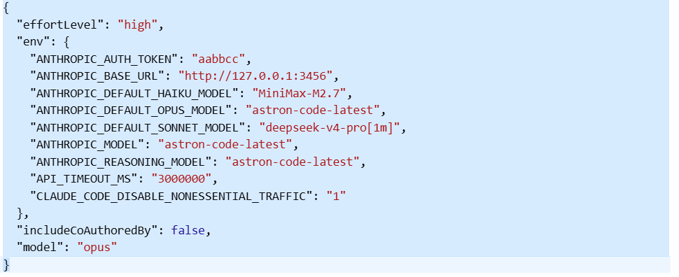

# CC-Switch Proxy
同时使用cc-switch接入三个第三方的api，在使用的过程中简单的任务例如读取文档，查看代码这些可以交给便宜的api模型进行处理，复杂的任务使用昂贵模型，这样减少费用。
在使用的过程中可以直接在对话框中输入委派子任务给haiku模型进行简单的任务即可。
Claude Code 三 API 路由代理，支持将不同模型请求智能路由到对应 API 提供商。

## 路由规则

| 模型 | 路由目标 | 用途 |
|------|----------|------|
| `astron-code-latest` | 讯飞 API | 主模型 (opus) |
| `deepseek-v4-pro` | DeepSeek API | 辅助模型 (sonnet) |
| `MiniMax-M2.7` | MiniMax API | 后台/haiku |

## 快速开始

### 1. 设置环境变量

```bash
# Windows PowerShell
$env:CCR_MAIN_KEY="你的讯飞API Key"
$env:CCR_SONNET_KEY="你的DeepSeek API Key"
$env:CCR_BG_KEY="你的MiniMax API Key"

# Mac/Linux
export CCR_MAIN_KEY="你的讯飞API Key"
export CCR_SONNET_KEY="你的DeepSeek API Key"
export CCR_BG_KEY="你的MiniMax API Key"
```

### 2. 启动代理

```bash
node proxy.js
```

代理将在 `http://127.0.0.1:3456` 启动。

### 3. 配置 CC-Switch

将 `cc-switch.config.json` 中的配置填入 CC-Switch：

- `ANTHROPIC_AUTH_TOKEN` 替换为你的 API Key
- `ANTHROPIC_BASE_URL` 指向代理地址


## 功能特性

- **消息清理 (sanitize)**：自动过滤无效内容块（保留历史 thinking 块）
- **`[1m]` 后缀自动剥离**：支持模型名带时间戳后缀
- **自动重试**：500/502/503 错误自动重试，提升稳定性
- **历史 thinking 块保留**：跨模型请求时保留 thinking 历史，防止 API 400 错误
- effort/thinking 头部透传
- thinking beta 自动过滤（防止 API 400 错误）
- 流式响应支持
- 健康检查端点 (`/health`)
- 模型列表端点 (`/v1/models`)

## API 端点

| 端点 | 方法 | 说明 |
|------|------|------|
| `/health` | GET | 健康检查 |
| `/v1/models` | GET | 模型列表 |
| `/v1/messages` | POST | 消息转发 |
